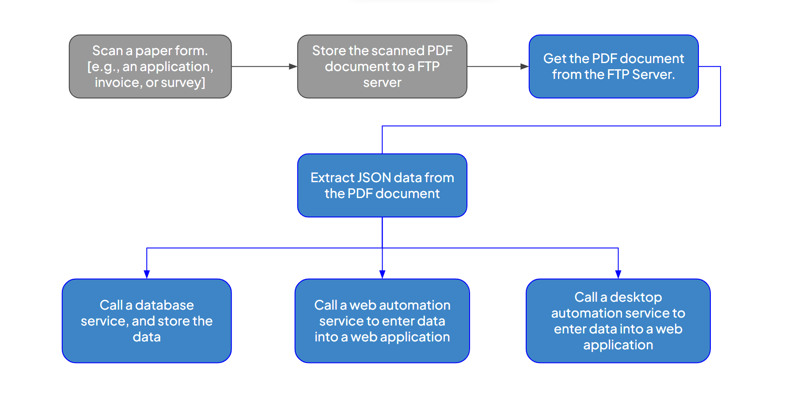

# Intelligent process automation

## Goal

This document provides a detailed explanation of a demo script showcasing an intelligent process automation use case built using Ballerina.

## Overview of Intelligent Process Automation

Automation is transforming the way businesses operate, unlocking new opportunities to achieve peak efficiency and innovation. Why is it crucial? Because it not only streamlines operations but also enhances workplace productivity and employee experiences. By taking over repetitive and mundane tasks, automation empowers teams to focus on creativity, innovation, and problem-solving—the key drivers of growth in today’s fast-paced world.

With advancements like Robotic Process Automation (RPA) and Intelligent Process Automation (IPA), businesses are reimagining workflows, adopting smarter and more agile processes to stay ahead of the competition.

### Robotic Process Automation (RPA)

Robotic Process Automation (RPA) is a technology that allows organizations to automate rule-based repetitive tasks and processes using software robots or "bots". These bots can mimic human actions to perform tasks such as data entry, transaction processing, and responding to simple customer service queries. RPA can help improve efficiency, reduce errors, and free up human workers to focus on more complex and value-added activities.

### Artificial Intelligence (AI)

One of the humans' most distinct qualities is their ability to make decisions and take action based on previous experience. Artificial Intelligence (AI) refers to the simulation of human intelligence in machines that are programmed to think and learn like humans. AI can be used to analyze large amounts of data, recognize patterns, and make decisions with minimal human intervention.

### How does RPA differ from AI?

While the use of artificial intelligence and RPA tools minimize the need for human intervention, the way in which they automate processes is different. The critical difference is that RPA is process-driven, whereas AI is data-driven. RPA bots can only follow the processes defined by an end user in a workflow, while AI bots use machine learning to recognize patterns in data, in particular unstructured data, and learn over time.

### Intelligent Process Automation (IPA)

Intelligent Process Automation (IPA) technology builds on top of RPA, incorporates AI capabilities such as ML, OCR, and NLP, and automates complex tasks that require intelligent decision-making.
In simple terms, **IPA = RPA + AI**.

## IPA use case

This demo script explains the following IPA use case.



The image represents an Intelligent Process Automation (IPA) use case for extracting and processing data from scanned documents. The workflow begins with scanning a physical form, such as an application, invoice, or survey, and saving it as a PDF. This scanned document is then stored on an FTP server, serving as a centralized location for further processing. Next, an automation system retrieves the PDF from the server, enabling structured data extraction.

Once the document is obtained, Optical Character Recognition (OCR) and AI-based tools extract its content and convert it into JSON format. This structured data can then be processed in multiple ways. It may be stored in a database for record-keeping or analytics, entered into a web application through web automation, or inputted into desktop applications via automation services. This ensures flexibility and compatibility with both modern and legacy systems.

Automation of such processes is highly significant in today’s digital landscape. It eliminates manual data entry, reducing human effort and minimizing errors. By enhancing efficiency and productivity, organizations can free up employees to focus on more strategic work. Moreover, automation improves accuracy and compliance, ensuring data integrity while mitigating compliance risks. Another key benefit is seamless integration with both legacy and modern systems, making it a valuable solution for industries that rely heavily on document processing, such as finance, healthcare, insurance, and government.

## IPA in action with Ballerina

### Step 1 - Setting up the project and implementing prerequisites.

**1. Navigate to the folder you want to create the project.**
**2. Execute the below command.**

```bash
bal new ipa_demo
```

**3. Start the VS code by executing the command below.**

```bash
code ipa_demo
```

**4. Create a new module [`modules/types`](./modules/types/) for declaring record types and create a new file `main.bal`.**

- Click on the visualize code lens and add a new component using the `+ Component` button.
- Select `Data mapper` under `Constructs`.
- Choose `Import A JSON`.
- Provide `Record Name` as `Student`, and for the `Sample JSON`, copy the [sample data](./resources/SampleData.json). Ensure the `Make separate record definitions` option is checked.
- The required records will be automatically created using **Ballerina's data mapper** feature.

**5. Set up the database tables.**

- Create a database and use the provided [SQL schema](./resources/tables.sql) to create the necessary tables.

### Step 2: Automate extracting Required Data as JSON from a Filled Application Form

This process involves two crucial steps to ensure accurate and efficient data extraction:

- **Converting Document Pages to Images**:
    Each page of the document will be converted into an image format. This step is essential as it prepares the document for further processing by transforming it into a format that can be easily analyzed. We will utilize the **Ballerina pdfbox module** to achieve this conversion, ensuring that each page is accurately rendered as an image.

- **Processing Images with OpenAI API**:
    Once the document pages are converted into images, the next step is to extract the required data. We will send these images, along with a predefined JSON schema, to the OpenAI API. The API will process the images and retrieve the data in JSON format. This step leverages the **Ballerina OpenAI chat client connector** and **Ballerina's JSON handling capabilities**, which facilitates seamless communication with the OpenAI API, ensuring that the data extraction is both accurate and efficient.


**1. Create a new module [`modules/pdfToJson`](./modules/pdfToJSON/) and create a new file under `constants.bal`.**
**2. In `constants.bal` copy the below code.**
```ballerina
public configurable string openAIApiKey = ?;

public configurable string openaiURL = "https://api.openai.com/v1";

public configurable string systemPrompt = string `You are an intelligent assistant tasked with analyzing text extracted from images of scanned forms using OCR technology. Your goal is to (as per the provided schema) based on the extracted text. [Important] You will not assume any value by yourself and always double-check the form carefully and confirm each value.`;


public configurable string userPrompt = string `Give me the JSON object only for below form images according to the given schema. Kindly go through the form carefully. \n\n
                # Important points \n
                1. If you cannot find the value for a particular text field mark it as null. \n
                2. Give the response as plain text(json) without code format. \n
                3. Enclose the field names with quotes. \n\n # The schema: `;
```

**3. Create new file under the same module, `main.bal`, and create a function to extract JSON data.**

```ballerina
# This function converts a PDF file to a JSON object based on the provided schema.
#
# + path - The path to the PDF file
# + jsonSchema - The schema for the JSON object
# + return - Returns the JSON object or an error
public function convertPDFToJSON(string path, string jsonSchema) returns json|error {
    string[] base64Images = check convertPDFToImages(path);
    json|error jsonData = check convertImagesToJson(base64Images, jsonSchema);
    return jsonData;
}
```

**4. Implement a function to convert document to images.**

- Import module pdfbox.
```ballerina
import xlibb/pdfbox;
```

- Create function `convertPDFToImages()`.

```ballerina
function convertPDFToImages(string path) returns string[]|error {
    string[] base64Images = check pdfbox:toImagesFromFile(path);
    return base64Images;
}
```

**5. Implement a function to extract JSON data from images.**

- Import connector `openai.chat`
- Click on the visualize code lens and add a new component using the `+ Component` button.
- Select `connector` under `Module level variables`
- Search for `openai` and select `ballerinax/openai.chat`.
- Rename variable name to `chatClient` and provide `openAIApiKey` as `token`. Finally, click `save`.
- Implement `convertImagesToJson()` function.

```ballerina
function convertImagesToJson(string[] base64Images, string jsonSchema) returns json|error {
    chat:ChatCompletionRequestMessage systemMessage = getSystemMessage();
    chat:ChatCompletionRequestMessage userMessage = getUserMessage(base64Images, jsonSchema);

    string jsonString = check processOpenAIApi(systemMessage, userMessage);
    return jsonString.fromJsonString();
}

function getSystemMessage() returns chat:ChatCompletionRequestMessage {
    return {
        role: "system",
        content: systemPrompt
    };
}

function getUserMessage(string[] base64Images, string schema) returns chat:ChatCompletionRequestMessage {
    chat:ChatCompletionRequestMessageContentPartImage[] imgContent = [];

    foreach string img in base64Images {
        imgContent.push({"type": "image_url", image_url: {url: "data:image/png;base64," + img}});
    }

    return {
        role: "user",
        content: [
            {
                "type": "text",
                text: string `${userPrompt}${schema}`
            },
            ...imgContent
        ]
    };
}

function processOpenAIApi(chat:ChatCompletionRequestMessage systemMessage,
        chat:ChatCompletionRequestMessage userMessage) returns string|error {

    chat:CreateChatCompletionResponse openAIResponse = check chatClient->/chat/completions.post({
        model: "gpt-4o",
        messages: [systemMessage, userMessage]
    });

    string? jsonString = openAIResponse.choices[0].message.content;

    if jsonString is string {
        return jsonString;
    }
    return error("Failed to process open ai api response.");
}
```
Check [OpenAI API reference](https://platform.openai.com/docs/api-reference/chat/create) to learn more about image input.

### Step 3: Implement use case 1 - Storing extracted data in the database.

In this use case, we will demonstrate how to store the extracted data in a database using the **Ballerina MySQL client connector**. This step is crucial for maintaining a structured and easily accessible repository of the processed information.

**1. Create a new module [`modules/db`](./modules/db/) and create a new file under that `main.bal`.**
**2. Copy the below code in `main.bal`.**
```ballerina
import ballerina/io;
import ballerina/uuid;
import ballerinax/mysql;
import ballerinax/mysql.driver as _;

// configure Database
configurable string dbHost = ?;
configurable string dbUsername = ?;
configurable string dbPassword = ?;
configurable string dbName = ?;
configurable int dbPort = ?;

public function storeInDatabase(types:Student data) returns error? {
    mysql:Client db = check new (dbHost, dbUsername, dbPassword, dbName, dbPort);

    string student_id = uuid:createType1AsString();
    string ol_id = uuid:createType1AsString();
    string al_id = uuid:createType1AsString();

    _ = check db->execute(`INSERT INTO student
                VALUES (${student_id}, ${data.fullName}, ${data.nameWithInitials}, ${data.dob}, ${data.age},
                ${data.nationality}, ${data.gender}, ${data.address}, ${data.mobile},
                ${data.district}, ${data.gramaSevaka}, ${data.nic},
                ${data.passport});`);

    _ = check db->execute(`INSERT INTO emergencycontact (name, address, mobile, relationship, email, studentId)
                VALUES (${data.emergency.name}, ${data.emergency.address}, ${data.emergency.mobile}, ${data.emergency.relationship}, ${data.emergency.email},
                ${student_id});`);

    _ = check db->execute(`INSERT INTO olresults
                        VALUES (${ol_id}, ${data.olResults.school}, ${data.olResults.year}, ${data.olResults.index}, ${student_id});`);

    foreach types:ResultsItem item in data.olResults.results {
        _ = check db->execute(`INSERT INTO olresultdetails (olResultId, subject, grade)
                        VALUES (${ol_id}, ${item.subject}, ${item.grade});`);
    }

    _ = check db->execute(`INSERT INTO alresults
                        VALUES (${al_id}, ${data.alResults.school}, ${data.alResults.year}, ${data.alResults.index},  ${data.alResults.zScore}, ${student_id});`);

    foreach types:ResultsItem item in data.alResults.results {
        _ = check db->execute(`INSERT INTO alresultdetails (alResultId, subject, grade)
                        VALUES (${al_id}, ${item.subject}, ${item.grade});`);
    }

    foreach types:OtherQualificationsItem item in data.otherQualifications {
        _ = check db->execute(`INSERT INTO otherqualifications (course, nvqLevel, institute, year, result, studentId)
                        VALUES (${item.course}, ${item.nvqLevel}, ${item.institute}, ${item.year}, ${item.result}, ${student_id});`);
    }

    foreach types:RefreesItem item in data.refrees {
        _ = check db->execute(`INSERT INTO referees (name, designation, address, mobile, studentId)
                        VALUES (${item.name}, ${item.designation}, ${item.address}, ${item.mobile}, ${student_id});`);
    }

    io:println("Data has stored to database successfully!");
}
```

### Step 4: Implement use case 2 - Automate filling a web application form using extracted data

To automate the data entry into a web application, we will use the **Ballerina Selenium module**. Selenium allows us to interact with web browsers directly, simulating user actions such as clicks, text input, page navigation, and more. This enables us to automate the process of filling out web forms with the extracted data, ensuring accuracy and efficiency while reducing manual effort.

**1. Create a new module [`modules/web_automation`](./modules/web_automation/) and create a new file under that `main.bal`.**
**2. Copy the below code in `main.bal`.**
```ballerina
import ballerina/io;
import ballerina/lang.runtime;

import xlibb/selenium;

public function fill(types:Student data) returns error? {

    selenium:WebDriver driver = check new ({
        url: "https://ballerina-ipa.choreoapps.dev/student-application",
        additionalArguments: ["--start-maximized"]
    });

    runtime:sleep(2);

    // Fill personal details
    selenium:WebElement fullNameElement = check driver.findById("fullName");
    check fullNameElement.sendKeys(data.fullName);

    selenium:WebElement nameWithInitialsElement = check driver.findById("nameWithInitials");
    check nameWithInitialsElement.sendKeys(data.nameWithInitials);

    selenium:WebElement dobElement = check driver.findById("dob");
    check dobElement.sendKeys(data.dob);

    selenium:WebElement ageElement = check driver.findById("age");
    check ageElement.sendKeys(data.age);

    selenium:WebElement nationalityElement = check driver.findById("nationality");
    check nationalityElement.sendKeys(data.nationality);

    selenium:WebElement genderElement = check driver.findById(data.gender);
    check genderElement.click();

    selenium:WebElement addressElement = check driver.findById("address");
    check addressElement.sendKeys(data.address);

    selenium:WebElement mobileElement = check driver.findById("mobile");
    check mobileElement.sendKeys(data.mobile);

    selenium:WebElement districtElement = check driver.findById("district");
    check districtElement.sendKeys(data.district);

    selenium:WebElement gramaSevakaElement = check driver.findById("gramaSevaka");
    check gramaSevakaElement.sendKeys(data.gramaSevaka);

    selenium:WebElement nicElement = check driver.findById("nic");
    check nicElement.sendKeys(data.nic ?: "");

    selenium:WebElement passportElement = check driver.findById("passport");
    check passportElement.sendKeys(data.passport ?: "");

    // Fill emergency contact details
    selenium:WebElement emerNameElement = check driver.findById("emer-name");
    check emerNameElement.sendKeys(data.emergency.name);

    selenium:WebElement emerAddressElement = check driver.findById("emer-address");
    check emerAddressElement.sendKeys(data.emergency.address);

    selenium:WebElement emerMobileElement = check driver.findById("emer-mobile");
    check emerMobileElement.sendKeys(data.emergency.mobile);

    selenium:WebElement relationshipElement = check driver.findById("relationship");
    check relationshipElement.sendKeys(data.emergency.relationship);

    selenium:WebElement emerEmailElement = check driver.findById("emer-email");
    check emerEmailElement.sendKeys(data.emergency.email);

    // Fill O/L results
    selenium:WebElement olSchoolElement = check driver.findById("ol-school");
    check olSchoolElement.sendKeys(data.olResults.school);

    selenium:WebElement olYearElement = check driver.findById("ol-year");
    check olYearElement.sendKeys(data.olResults.year);

    selenium:WebElement olIndexElement = check driver.findById("ol-index");
    check olIndexElement.sendKeys(data.olResults.index);

    selenium:WebElement olSubjectElement = check driver.findById("ol-subject");
    selenium:WebElement olGradeElement = check driver.findById("ol-grade");
    selenium:WebElement addOlResultElement = check driver.findById("add-ol-result");

    foreach types:ResultsItem item in data.olResults.results {
        check olSubjectElement.sendKeys(item.subject);
        check olGradeElement.sendKeys(item.grade);
        check addOlResultElement.click();
    }

    // Fill A/L results
    selenium:WebElement alSchoolElement = check driver.findById("al-school");
    check alSchoolElement.sendKeys(data.alResults.school);

    selenium:WebElement alYearElement = check driver.findById("al-year");
    check alYearElement.sendKeys(data.alResults.year);

    selenium:WebElement alIndexElement = check driver.findById("al-index");
    check alIndexElement.sendKeys(data.alResults.index);

    selenium:WebElement zScoreElement = check driver.findById("zScore");
    check zScoreElement.sendKeys(data.alResults.zScore);

    selenium:WebElement alSubjectElement = check driver.findById("al-subject");
    selenium:WebElement alGradeElement = check driver.findById("al-grade");
    selenium:WebElement addAlResultElement = check driver.findById("add-al-result");
    foreach types:ResultsItem item in data.alResults.results {
        check alSubjectElement.sendKeys(item.subject);
        check alGradeElement.sendKeys(item.grade);
        check addAlResultElement.click();
    }

    // Fill other qualifications
    selenium:WebElement courseElement = check driver.findById("course");
    selenium:WebElement nvqElement = check driver.findById("nvq");
    selenium:WebElement instituteElement = check driver.findById("institute");
    selenium:WebElement nvqYearElement = check driver.findById("nvq-year");
    selenium:WebElement nvqResultElement = check driver.findById("nvq-result");
    selenium:WebElement addNvqResultElement = check driver.findById("add-nvq-result");

    foreach types:OtherQualificationsItem item in data.otherQualifications {
        check courseElement.sendKeys(item.course);
        check nvqElement.sendKeys(item.nvqLevel);
        check instituteElement.sendKeys(item.institute);
        check nvqYearElement.sendKeys(item.year);
        check nvqResultElement.sendKeys(item.result);
        check addNvqResultElement.click();
    }

    // Fill Extra curricular activities
    selenium:WebElement extraActivitiesElement = check driver.findById("extra-activities");
    check extraActivitiesElement.sendKeys(data.extraCurricularActivities);

    // Fill Referees
    selenium:WebElement refreeNameElement = check driver.findById("refree-name");
    selenium:WebElement designationElement = check driver.findById("designation");
    selenium:WebElement refreeAddressElement = check driver.findById("refree-address");
    selenium:WebElement refreeMobileElement = check driver.findById("refree-mobile");
    selenium:WebElement addRefreeElement = check driver.findById("add-refree");

    foreach types:RefreesItem item in data.refrees {
        check refreeNameElement.sendKeys(item.name);
        check designationElement.sendKeys(item.designation);
        check refreeAddressElement.sendKeys(item.address);
        check refreeMobileElement.sendKeys(item.mobile);
        check addRefreeElement.click();
    }

    // Submit the form
    selenium:WebElement submitButtonElement = check driver.findById("submit");
    check submitButtonElement.click();

    // Close the browser
    // check driver.quit();

    io:println("Data entered successfully!");

}

```

### Step 5: Filling a desktop application form using extracted data

To automate data entry into a desktop application, we will use the **Ballerina Sikulix library**. Sikulix enables image-based automation by identifying elements through screenshots, allowing for precise control through coordinate-based interaction. With its built-in OCR capabilities, Sikulix can recognize and interact with on-screen text. Additionally, it is cross-platform, supporting Windows, macOS, and Linux.

**1. Create a new module [`modules/desktop_automation`](./modules/desktop_automation/) and create a new file under that `main.bal`.**
**2. Copy the below code in `main.bal`.**


```ballerina
import ballerina/file;
import ballerina/io;
import ballerina/lang.runtime;
import ballerina/os;

import xlibb/sikulix;

string basePath = file:getCurrentDir();
string imagespath = basePath + "/resources/elements";
string appPath = basePath + "/resources/student_app.jar";

public function fill(types:Student data) returns error? {

    // Open the application
    _ = check os:exec({value: "java", arguments: ["-jar", appPath]});
    runtime:sleep(1);

    sikulix:Screen screen = check new ();

    // Fill personal details
    check screen.'type(data.fullName + "\t");
    check screen.'type(data.nameWithInitials + "\t");
    check screen.'type(data.dob + "\t");
    check screen.'type(data.age + "\t");
    check screen.'type(data.nationality + "\t");
    check (check screen.find(string `${imagespath}/${data.gender}.png`)).click();
    check scrollToBottom(screen);
    check (check screen.find(string `${imagespath}/address.png`)).'type(data.address + "\t");
    check screen.'type(data.mobile + "\t");
    sikulix:Match districtMatch = check screen.find(imagespath + "/district.png");
    check districtMatch.click();
    sikulix:Region dropDownRegion = check new ({
        topLeftX: check districtMatch.getTopLeftX(),
        topLeftY: check districtMatch.getTopLeftY(),
        width: 200,
        height: 20
    });
    int count = 0;
    while dropDownRegion.getText() != data.district && count <= 25 {
        check screen.keyPress(sikulix:DOWN);
        dropDownRegion = check new ({
            topLeftX: check districtMatch.getTopLeftX(),
            topLeftY: check districtMatch.getTopLeftY(),
            width: 200,
            height: 20
        });
        count = count + 1;
    }
    check screen.keyPress(sikulix:ENTER);
    check screen.'type("\t" + data.gramaSevaka + "\t");
    check screen.'type(data.nic ?: "" + "\t");
    check screen.'type(data.passport ?: "" + "\t");
    sikulix:Match nextBtnMatch = check screen.find(imagespath + "/next.png");
    check nextBtnMatch.click();

    // Fill emergency contact details
    sikulix:Match emergencyNameMatch = check screen.find(imagespath + "/emergencyName.png");
    check emergencyNameMatch.'type(data.emergency.name + "\t");
    check screen.'type(data.emergency.address + "\t");
    check screen.'type(data.emergency.mobile + "\t");
    check screen.'type(data.emergency.relationship + "\t");
    check screen.'type(data.emergency.email + "\t");
    nextBtnMatch = check screen.find(imagespath + "/next.png");
    check nextBtnMatch.click();

    // Fill OL results
    sikulix:Match olSchoolNameMatch = check screen.find(imagespath + "/OLSchool.png");
    check olSchoolNameMatch.'type(data.olResults.school + "\t");
    check screen.'type(data.olResults.year + "\t");
    check screen.'type(data.olResults.index + "\t");
    check scrollToBottom(screen);
    foreach types:ResultsItem item in data.olResults.results {
        sikulix:Match olSubjectNameMatch = check screen.find(imagespath + "/olsubject.png");
        check olSubjectNameMatch.'type(item.subject + "\t");
        check screen.'type(item.grade);
        sikulix:Match addResultBtnMatch = check screen.find(imagespath + "/addResult.png");
        check addResultBtnMatch.click();
    }
    nextBtnMatch = check screen.find(imagespath + "/next.png");
    check nextBtnMatch.click();

    // Fill AL results
    sikulix:Match alSchoolNameMatch = check screen.find(imagespath + "/alSchool.png");
    check alSchoolNameMatch.'type(data.alResults.school + "\t");
    check screen.'type(data.alResults.year + "\t");
    check screen.'type(data.alResults.index + "\t");
    check screen.'type(data.alResults.zScore + "\t");
    check scrollToBottom(screen);
    foreach types:ResultsItem item in data.alResults.results {
        sikulix:Match alSubjectNameMatch = check screen.find(imagespath + "/alSubject.png");
        check alSubjectNameMatch.'type(item.subject + "\t");
        check screen.'type(item.grade);
        sikulix:Match addResultBtnMatch = check screen.find(imagespath + "/addResult.png");
        check addResultBtnMatch.click();
    }
    nextBtnMatch = check screen.find(imagespath + "/next.png");
    check nextBtnMatch.click();

    // Fill other qualifications
    foreach types:OtherQualificationsItem item in data.otherQualifications {
        sikulix:Match courseNameMatch = check screen.find(imagespath + "/course.png");
        check courseNameMatch.'type(item.course + "\t");
        check screen.'type(item.nvqLevel + "\t");
        check screen.'type(item.institute + "\t");
        check screen.'type(item.year + "\t");
        check screen.'type(item.result + "\t");
        sikulix:Match addResultBtnMatch = check screen.find(imagespath + "/addResult.png");
        check addResultBtnMatch.click();
    }
    check scrollToBottom(screen);
    nextBtnMatch = check screen.find(imagespath + "/next.png");
    check nextBtnMatch.click();

    // Fill referees details
    foreach types:RefreesItem item in data.refrees {
        sikulix:Match refereeNameMatch = check screen.find(imagespath + "/refereeName.png");
        check refereeNameMatch.'type(item.name + "\t");
        check screen.'type(item.designation + "\t");
        check screen.'type(item.address + "\t");
        check screen.'type(item.mobile + "\t");
        sikulix:Match addResultBtnMatch = check screen.find(imagespath + "/addReferee.png");
        check addResultBtnMatch.click();
    }

    // Submit the form
    sikulix:Match finishBtnMatch = check screen.find(imagespath + "/finish.png");
    check finishBtnMatch.click();

    io:println("Data entered successsfully!");
}

function scrollToBottom(sikulix:Screen screen) returns sikulix:Error? {
    sikulix:Match|sikulix:Error nextBtn = screen.find(string `${imagespath}/next.png`);
    while nextBtn is sikulix:FindFailedError {
        check screen.wheel(1, 3);
        nextBtn = screen.find(string `${imagespath}/next.png`);
    }
}
```

### Step 6: Combining all together

**1. Open `main.bal` in the root directory and remove existing code.**
**2. Copy the below code in `main.bal`.**

```ballerina
import ballerina/io;

import thisarug/prettify;

public function main() returns error? {

    // Getting json data from the pdf
    io:println("Extracting data from the PDF...");
    json targetJsonSchema = check io:fileReadJson("./resources/jsonSchema.json");
    json jsonExtractedFromPDF = check pdfToJSON:convertPDFToJSON("./resources/form.pdf", targetJsonSchema.toString());
    io:println("\nReceived JSON data from open AI: ", prettify:prettify(jsonExtractedFromPDF));

    // Converting the json data to the record type
    types:Student data = check jsonExtractedFromPDF.fromJsonWithType(types:Student);

    // Use case 1
    io:println("Storing data in the database...");
    check db:storeInDatabase(data);

    // Use case 2
    io:println("Filling the form in the web application...");
    check web_automation:fill(data);

    // Use case 3
    io:println("Filling the form in the desktop application...");
    check desktop_automation:fill(data);

    io:println("Process completed successfully.");
}
```

**3. Create `Config.toml` in root directory of the project and update configuration variables as below**

```toml
[ipa_demo.db]
dbHost = "YOUR_HOST"
dbUsername = "YOUR_USERNAME"
dbPassword = "YOUR_PASSWORD"
dbName = "DATABASE_NAME"
dbPort = "YOUR_PORT"

[ipa_demo.pdfToJSON]
openAIApiKey = "YOUR_OPENAI_API_KEY"
```

**4. Setting up resources folder.**
- Create folder `resources` under the root directory and copy the content in [this](./resources/) folder.

We are all set to see the automation. Run the below command in the root directory to run the demo.

```bash
bal run
```
